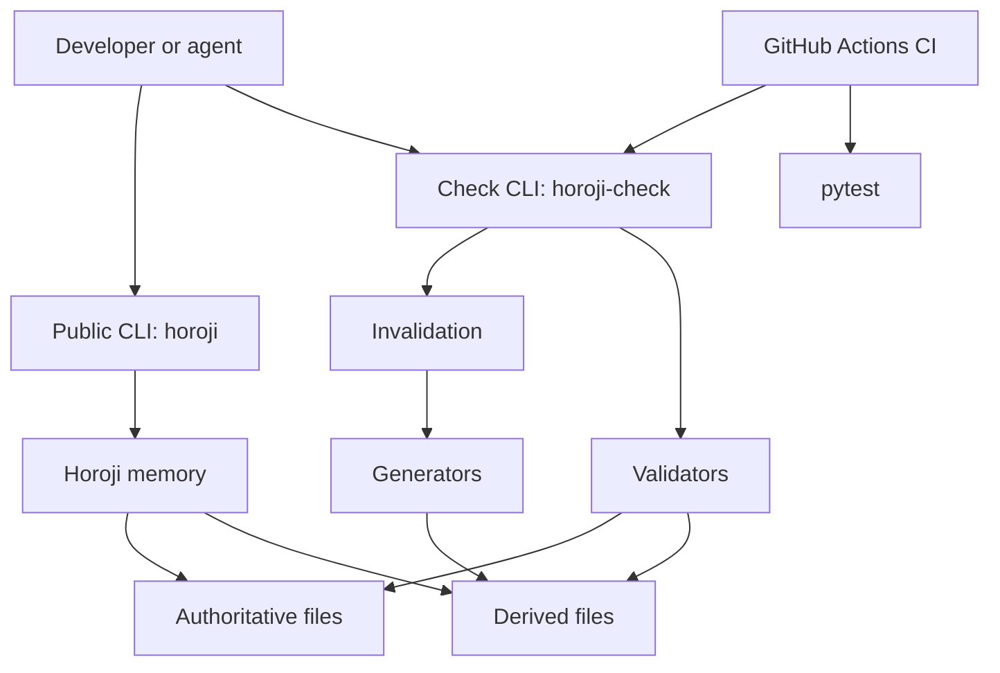
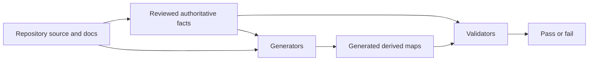
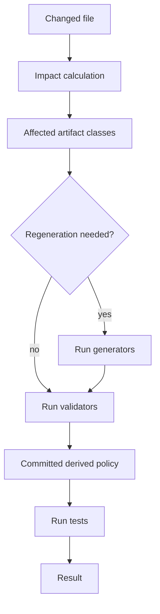
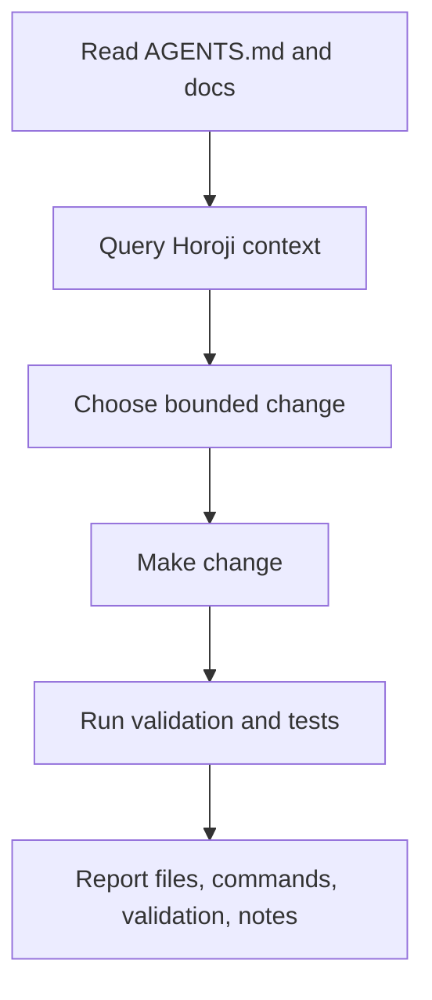
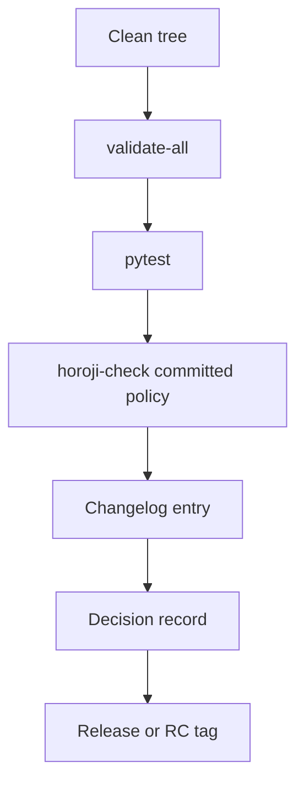

# Page 4: Workflow Diagrams

Previous: [Key Terms and Options](page-3-key-terms-and-options.md)
Next: [First-Hour Walkthrough](page-5-first-hour-walkthrough.md)

These diagrams show how the main pieces connect.

## System Map

## Authoritative vs Derived Flow

## Change Validation Workflow

## Agent Workflow

## Release Gate Workflow

## Keep Diagrams Simple

The diagrams are maps, not proof.

Use the formal governance docs for exact release and validation rules.
